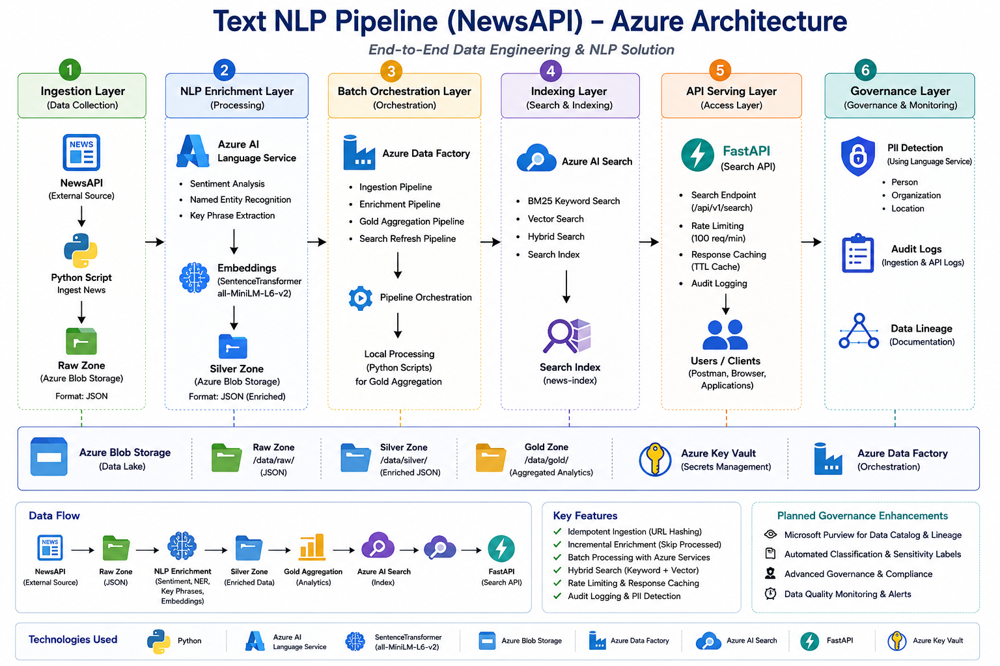

# Text NLP Pipeline using Azure

## Project Overview

This project implements an end-to-end cloud-native Text NLP Pipeline that ingests news articles from NewsAPI, enriches them using Natural Language Processing (NLP) techniques, indexes them in Azure AI Search, and exposes them through a REST API for semantic and keyword-based retrieval.

The pipeline follows a modern multi-layered architecture consisting of Raw, Silver, and Gold data zones. It leverages Microsoft Azure services for storage, orchestration, search, NLP enrichment, and secret management.

The main objectives of this project are:

- Ingest news articles from NewsAPI across multiple categories.
- Perform NLP enrichment including sentiment analysis, named entity recognition, key phrase extraction, and vector embedding generation.
- Store data using a layered data lake architecture (Raw, Silver, and Gold zones).
- Index enriched articles in Azure AI Search for efficient retrieval.
- Generate analytical outputs such as sentiment trends and trending keywords.
- Expose a search API for consumers.
- Implement governance features such as PII detection and audit logging.

The project uses the free tier of NewsAPI, which allows up to 100 requests per day.


## Architecture Diagram




## Technology Stack

| Category | Technologies Used |
|-----------|------------------|
| Programming Language | Python 3.11 |
| Cloud Platform | Microsoft Azure |
| Storage | Azure Blob Storage |
| NLP | Azure AI Language Service, SentenceTransformers |
| Search Engine | Azure AI Search |
| Orchestration | Azure Data Factory |
| API Framework | FastAPI |
| Data Processing | Pandas |
| Configuration Management | python-dotenv |
| Documentation | Markdown |


## Azure Services Used

The following Azure services were successfully implemented in this project:

- Azure Blob Storage
- Azure AI Language Service
- Azure AI Search
- Azure Data Factory
- Azure Key Vault

The following enterprise services are represented architecturally and can be integrated in future enhancements depending on subscription availability:

- Azure Functions
- Logic Apps
- Event Grid
- Azure API Management (APIM)
- Microsoft Purview
- Azure OpenAI

# Project Architecture

## Layer 1 - Ingestion

### Objective

The objective of the ingestion layer is to collect news articles from NewsAPI across multiple categories, validate and deduplicate the incoming records, and persist the raw articles for downstream processing.

This layer acts as the entry point of the entire pipeline.


### Implemented Architecture

The following architecture was implemented in this project:

NewsAPI
    ↓
Python Ingestion Pipeline
    ↓
Article Validation
    ↓
URL Hash Generation
    ↓
Deduplication
    ↓
Raw Layer (Local Storage)
    ↓
Azure Blob Storage (raw-zone)


### Project Structure

The ingestion logic is implemented inside:

src/
└── ingestion/
      └── ingest_newsapi.py


Raw articles are stored locally using a date-partitioned structure:

data/
└── raw/
      ├── 2026-06-21/
      ├── 2026-06-22/
      └── 2026-06-24/

The same files are uploaded to Azure Blob Storage under the `raw-zone` container.


### Features Implemented

The ingestion layer supports:

* Multi-category article ingestion.
* NewsAPI integration.
* Raw JSON persistence.
* URL hash generation.
* Duplicate detection and removal.
* Incremental ingestion.
* Batch metadata logging.
* Upload to Azure Blob Storage.


### Categories Ingested

News articles are collected across the following categories:

* Business
* Entertainment
* General
* Health
* Science
* Sports
* Technology

This approach provides broad topic coverage while remaining within the NewsAPI free-tier quota.


### Design Decisions

#### Why NewsAPI?

NewsAPI was selected because it provides:

* Free developer access.
* Category-based article retrieval.
* Structured JSON responses.
* Sufficient daily request limits for academic and research projects.

The free tier allows:

100 requests/day
100 articles/request

which is adequate for building and evaluating the pipeline.

#### Why URL Hash-Based Deduplication?

The same article may appear:

* across multiple categories,
* across multiple ingestion runs,
* or in repeated API responses.

To guarantee idempotent ingestion, a unique SHA-256 hash is generated using the article URL.

Example:

article_hash = sha256(article_url.encode()).hexdigest()

This hash serves as the primary deduplication key.

Benefits include:

* Preventing duplicate storage.
* Supporting incremental processing.
* Ensuring idempotent pipeline execution.
* Avoiding unnecessary downstream enrichment.

### Azure Services Used

The following Azure service was successfully implemented in this layer:

* **Azure Blob Storage**

Raw JSON files generated by the ingestion pipeline are automatically uploaded to the Blob Storage landing zone (`raw-zone`).

### Enterprise Architecture Considerations

The original enterprise architecture proposed:

Logic Apps
      ↓
NewsAPI
      ↓
Azure Blob Storage
      ↓
Event Grid
     ↙        ↘
NLP Function  Audit Function

In a production deployment:

* Azure Logic Apps can schedule NewsAPI polling.
* Event Grid can automatically trigger downstream processing when new files arrive.
* Azure Functions can initiate NLP enrichment and audit workflows.

Due to Azure free subscription limitations and hosting plan constraints, a modular Python-based ingestion workflow was implemented instead.

The current implementation preserves the same logical architecture and can be migrated to:

* Azure Function (Timer Trigger)
* Azure Logic App HTTP workflow
* Azure Data Factory HTTP activity

with minimal code changes.

### Audit Logging

Execution metadata and ingestion statistics are recorded during each run.

Examples include:

* Number of articles ingested.
* Number of duplicates skipped.
* Batch execution timestamps.
* Processing status.

This partially simulates the audit logging functionality proposed in the original architecture.

### Final Layer Workflow

NewsAPI
    ↓
Python Ingestion Script
    ↓
Generate URL Hash
    ↓
Remove Duplicates
    ↓
Store Raw JSON
    ↓
Upload to Azure Blob Storage
    ↓
Record Batch Metadata

## Layer 2 - NLP Enrichment

### Objective

The objective of the NLP enrichment layer is to transform raw news articles into enriched analytical documents by extracting semantic information such as sentiment, named entities, key phrases, and vector embeddings.

The enriched articles are then stored in the Silver layer for downstream analytics and search indexing.


### Implemented Architecture

The following architecture was implemented:

Raw Articles
      ↓
Azure AI Language Service
      ↓
Sentiment Analysis
Named Entity Recognition
Key Phrase Extraction
      ↓
PII Detection
      ↓
Vector Embedding Generation
      ↓
Silver Layer
      ↓
Azure Blob Storage (silver-zone)


### Project Structure

The enrichment logic is implemented inside:

src/
└── enrichment/
      └── nlp_enrichment.py


The enriched articles are stored using a date-partitioned structure:

data/
└── silver/
      ├── 2026-06-21/
      ├── 2026-06-22/
      └── 2026-06-24/

The same files are uploaded to Azure Blob Storage under:

silver-zone/
      └── YYYY-MM-DD/

### Features Implemented

The enrichment layer supports:

* Sentiment analysis.
* Named Entity Recognition (NER).
* Key phrase extraction.
* Vector embedding generation.
* PII detection.
* Incremental enrichment.
* Silver layer persistence.
* Azure Blob Storage integration.

### Azure AI Language Service Integration

Azure AI Language Service was integrated to perform enterprise-grade NLP enrichment.

The following NLP tasks are executed using Azure AI Language Service:

#### Sentiment Analysis

Each article is classified as:

* Positive
* Negative
* Neutral

A sentiment confidence score is also generated.

#### Named Entity Recognition (NER)

Important entities are extracted from each article.

Examples include:

* Person
* Organization
* Location
* Event
* Product

Example:

Microsoft → Organization
Satya Nadella → Person
India → Location


#### Key Phrase Extraction

Important phrases are automatically extracted from article content.

Example:

"exciting new AI products"
"artificial intelligence"
"global economic growth"

Key phrases improve:

* Search relevance.
* Trend analysis.
* Gold layer analytics.

### Vector Embedding Generation

Semantic vector embeddings are generated for every article using:

SentenceTransformer("all-MiniLM-L6-v2")

These embeddings enable:

* Semantic search.
* Similar article retrieval.
* Vector indexing in Azure AI Search.

### Why SentenceTransformers?

The original enterprise architecture proposed:

Azure OpenAI
       ↓
Embeddings

However, Azure OpenAI access requires:

* Additional subscription approval.
* Region availability.
* Enterprise-level access permissions.

Since Azure OpenAI was unavailable under the current Azure free subscription, SentenceTransformers were selected as an alternative.

Both approaches generate dense semantic vectors and follow the same conceptual architecture.

The current implementation can be migrated to Azure OpenAI embeddings with minimal code modifications.

### Incremental Enrichment Strategy

To avoid unnecessary re-processing, previously enriched articles are automatically skipped.

Every article contains a unique:

article_hash

Before enrichment, the system checks whether the article has already been processed.

Benefits include:

* Reduced execution time.
* Lower computational cost.
* Idempotent pipeline execution.
* Avoidance of duplicate NLP scoring.

### PII Detection

A lightweight governance mechanism was implemented to identify potentially sensitive content.

Articles containing the following entity types are flagged:

* PERSON
* ORGANIZATION
* LOCATION

Example:

{
  "contains_pii": true,
  "pii_entities": [
      "Person",
      "Organization"
  ]
}


This functionality partially simulates enterprise data governance workflows.

### Azure Services Used

The following Azure services were successfully implemented in this layer:

* Azure AI Language Service
* Azure Blob Storage

Azure AI Language Service performs the NLP enrichment, while Azure Blob Storage persists the Silver layer outputs.


### Enterprise Architecture Considerations

The original architecture proposed:

Azure Function
       ↓
Azure AI Language Service
       ↓
Azure OpenAI Embeddings
       ↓
ADLS Gen2 (Silver Layer)

In a production deployment:

* Azure Functions can automatically process newly arrived raw files.
* Azure OpenAI can generate enterprise embeddings.
* ADLS Gen2 can serve as the centralized Silver storage layer.

Due to Azure free subscription limitations and access restrictions, the following alternatives were implemented:

| Proposed Service | Implemented Alternative |
| ---------------- | ----------------------- |
| Azure Function   | Local Python Pipeline   |
| Azure OpenAI     | SentenceTransformers    |
| ADLS Gen2        | Azure Blob Storage      |

The enrichment pipeline was intentionally designed to remain modular, allowing future migration to these Azure-native services without significant architectural changes.


### Batch Processing Considerations

The enrichment pipeline processes articles in batches.

Special considerations include:

* Skipping already processed articles.
* Handling empty article content.
* Supporting partial batch execution.
* Preventing duplicate enrichment.

These design decisions ensure reliable and scalable execution.


### Final Layer Workflow

Raw Articles
      ↓
Azure AI Language Service
      ↓
Sentiment Analysis
Named Entity Recognition
Key Phrase Extraction
      ↓
PII Detection
      ↓
Generate Embeddings
      ↓
Store Enriched Articles
      ↓
Upload to Azure Blob Storage


## Layer 3 - Batch Orchestration

### Objective

The objective of the batch orchestration layer is to coordinate the execution of the complete pipeline, ensuring that ingestion, enrichment, analytics generation, and search indexing occur in the correct sequence.

This layer guarantees that downstream processes execute only after upstream dependencies have successfully completed.

### Implemented Architecture

The following orchestration architecture was implemented:

Azure Data Factory
        ↓
Ingestion
        ↓
NLP Enrichment
        ↓
Gold Aggregation
        ↓
Search Index Refresh

### Project Structure

The orchestration logic is implemented inside:

src/
└── orchestration/
      └── databricks_gold.py

Gold outputs are stored using a date-partitioned structure:

data/
└── gold/
      ├── 2026-06-21/
      ├── 2026-06-22/
      └── 2026-06-24/

The generated files are uploaded to Azure Blob Storage under:

gold-zone/
      └── YYYY-MM-DD/

### Azure Data Factory Implementation

An Azure Data Factory pipeline was created to orchestrate the overall workflow.

The pipeline consists of the following stages:

Ingestion
      ↓
Enrichment
      ↓
GoldAggregation
      ↓
SearchRefresh

The dependency chain ensures that each activity executes only after the previous activity has successfully completed.

This architecture closely resembles enterprise-grade batch data pipelines.

### Features Implemented

The orchestration layer supports:

* Workflow orchestration using Azure Data Factory.
* Dependency-based execution.
* Gold layer generation.
* Incremental processing.
* Idempotent Gold writes.
* Automated upload to Azure Blob Storage.

### Gold Layer Analytics

The Gold layer contains business-ready analytical datasets.

Three analytical outputs are generated:

#### 1. Sentiment Summary

Average sentiment scores are computed for each news category.

Example:

Business → 0.43
Technology → 0.61
Sports → 0.29

This dataset enables sentiment trend analysis across categories.

Generated file:

gold_sentiment_summary.csv

#### 2. Top Entities

Frequently occurring entities are identified across all articles.

Examples:

Microsoft
India
United States
Google

Generated file:

gold_top_entities.csv

#### 3. Trending Keywords

Trending keywords are identified using key phrases extracted from recent Silver layer batches.

A rolling-window approach is used to identify emerging trends.

Generated file:

gold_trending_keywords.csv

### Design Decisions

#### Why a Gold Layer?

The Raw and Silver layers contain operational and enriched data.

However, analytical workloads require aggregated, business-ready datasets.

The Gold layer provides:

* Faster analytics.
* Reduced query complexity.
* Reusable analytical datasets.
* Better separation of concerns.

#### Why Idempotent Gold Writes?

The Gold layer is designed to overwrite previously generated outputs during every execution.

This approach simulates Delta Lake:

REPLACE WHERE

semantics.

Benefits include:

* Consistent analytical outputs.
* Prevention of duplicate records.
* Simplified reprocessing.


### Databricks Simulation

The original enterprise architecture proposed:

Azure Data Factory
        ↓
Azure Databricks Notebook
        ↓
Gold Layer

Due to Azure free subscription limitations and cost considerations, Gold transformations were implemented locally using Python and Pandas.

The local implementation preserves the same logical processing model as Azure Databricks.

Implemented technologies:

* Pandas
* Counter
* Python batch processing

This design allows future migration of transformation logic into Azure Databricks notebooks with minimal changes.

### Azure Services Used

The following Azure services were successfully implemented:

* Azure Data Factory
* Azure Blob Storage

Azure Data Factory orchestrates the pipeline, while Azure Blob Storage persists the Gold layer outputs.

### Enterprise Architecture Considerations

The original architecture proposed:

ADF
      ↓
Databricks
      ↓
MLflow
      ↓
Gold Layer

In a production deployment:

* Azure Databricks notebooks would perform large-scale distributed transformations.
* MLflow would track model versions, experiments, and metrics.
* Delta Lake would provide transactional guarantees.

Due to free subscription limitations, the following alternatives were implemented:

| Proposed Service | Implemented Alternative  |
| ---------------- | ------------------------ |
| Azure Databricks | Python + Pandas          |
| MLflow           | Manual documentation     |
| Delta Lake       | Idempotent CSV overwrite |

The current architecture remains fully cloud-portable and can be migrated to Databricks with minimal code modifications.

### ADF Pipeline Design

The Azure Data Factory pipeline currently contains placeholder activities representing the complete workflow.

This design was intentionally chosen to preserve orchestration semantics while remaining compatible with Azure free subscription constraints.

Future versions can replace these placeholder activities with:

* Azure Functions
* Databricks notebooks
* REST API calls
* Web activities

without changing the overall pipeline structure.

### Final Layer Workflow

Azure Data Factory
        ↓
Run Ingestion
        ↓
Run NLP Enrichment
        ↓
Generate Gold Analytics
        ↓
Refresh Search Index
        ↓
Upload Gold Outputs to Azure Blob Storage


## Layer 4 - Indexing

### Objective

The objective of the indexing layer is to enable efficient retrieval of enriched news articles using Azure AI Search.

This layer transforms enriched Silver layer documents into searchable assets that can support keyword-based, semantic, and vector-driven search scenarios.

### Implemented Architecture

The following indexing architecture was implemented:

Silver Layer
      ↓
Document Preparation
      ↓
Embedding Generation
      ↓
Azure AI Search Index
      ↓
Search API


### Project Structure

The indexing logic is implemented inside:

src/
└── indexing/
      └── index_documents.py

The search API consumes indexed documents using:

src/
└── api/
      └── search_api.py


### Features Implemented

The indexing layer supports:

* Azure AI Search integration.
* Search index creation.
* Bulk document indexing.
* Vector embedding storage.
* Search API integration.
* Incremental index refresh.
* Search result retrieval.

### Azure AI Search Integration

Azure AI Search was used as the primary retrieval engine.

A dedicated search index named:

news-index

was created to store enriched articles.

The index enables efficient retrieval of news content while supporting future semantic and vector search capabilities.

### Indexed Fields

Each document stored in Azure AI Search contains enriched metadata including:

* Title
* Description
* Source Name
* Publication Date
* Category
* Sentiment Score
* Sentiment Label
* Named Entities
* Key Phrases
* Article Hash
* Vector Embedding

This rich metadata improves both search relevance and analytical capabilities.

### Why Azure AI Search?

Azure AI Search was selected because it provides:

* Enterprise-grade search capabilities.
* Full-text search support.
* Vector search support.
* Hybrid retrieval capabilities.
* Scalable indexing infrastructure.
* Seamless Azure ecosystem integration.

### Vector Embedding Storage

Every enriched article contains a dense semantic vector representation generated during the enrichment phase.

These embeddings are stored alongside article metadata within the search index.

Benefits include:

* Semantic similarity search.
* Similar article recommendation.
* Context-aware retrieval.
* Future hybrid search support.

The current implementation uses:

SentenceTransformer("all-MiniLM-L6-v2")


embeddings.


### Search Index Refresh Strategy

After Gold layer processing completes, the indexing pipeline refreshes the Azure AI Search index.

This ensures that:

* Newly enriched articles become searchable.
* Updated metadata is reflected in search results.
* Search consumers always access the latest content.

### Search Retrieval Workflow

The retrieval workflow follows:
User Query
      ↓
FastAPI Endpoint
      ↓
Azure AI Search
      ↓
Retrieve Relevant Documents
      ↓
Return Search Results

### Azure Services Used

The following Azure services were successfully implemented:

* Azure AI Search

Azure AI Search serves as the primary search and indexing engine for the platform.

### Design Decisions

#### Why store source data in Blob Storage instead of Azure AI Search?

Azure AI Search is optimized for retrieval workloads rather than long-term storage.

Blob Storage acts as the:

System of Record

while Azure AI Search acts as the:

Serving Layer

This separation provides:

* Better scalability.
* Lower storage costs.
* Easier reprocessing.
* Clear Raw/Silver/Gold separation.

#### Why store embeddings?

Traditional keyword search cannot always understand semantic similarity.

Embeddings allow:

* Context-aware retrieval.
* Similarity-based matching.
* Improved relevance.

Example:

Query:
"AI breakthroughs"

Retrieved Article:
"Latest advances in artificial intelligence"

Even though the exact keywords may differ, semantic similarity can still be identified.

### Enterprise Architecture Considerations

The original architecture proposed:

Azure AI Search
      ↓
BM25 Search
      +
Vector Search
      ↓
Hybrid Search
      ↓
Reciprocal Rank Fusion
      ↓
Semantic Ranker

The current implementation successfully integrates Azure AI Search and vector storage.

Future enhancements may include:

* True hybrid retrieval.
* HNSW parameter tuning.
* Reciprocal Rank Fusion (RRF).
* Semantic Ranker integration.
* Similarity search using vector queries.

These enhancements can be integrated without significant architectural modifications.


### Final Layer Workflow

Silver Layer
      ↓
Prepare Enriched Documents
      ↓
Store Embeddings
      ↓
Index Documents in Azure AI Search
      ↓
Expose Search Capabilities through API


## Layer 5 - API Serving

### Objective

The objective of the API Serving layer is to expose the indexed news articles through REST APIs, enabling consumers to perform keyword-based and semantic search over the processed news corpus.

This layer acts as the interface between end users and the underlying search infrastructure.

### Implemented Architecture

The following API architecture was implemented:

Client
    ↓
FastAPI
    ↓
Azure AI Search
    ↓
Search Results

### Project Structure

The API layer is implemented inside:

src/
└── api/
      └── search_api.py

The application exposes REST endpoints for querying indexed articles.

### Features Implemented

The API layer supports:

* REST-based search endpoints.
* Azure AI Search integration.
* API versioning.
* Response caching.
* Rate limiting.
* OpenAPI documentation.
* Search result serialization.

### FastAPI Implementation

FastAPI was selected as the API framework because it provides:

* High-performance asynchronous APIs.
* Automatic OpenAPI documentation.
* Lightweight deployment.
* Enterprise-ready REST architecture.

The API exposes search capabilities through:

GET /api/v1/search

Example:

GET /api/v1/search?query=artificial intelligence

### API Documentation

FastAPI automatically generates interactive Swagger documentation.

The documentation is available at:

http://localhost:8000/docs

This enables:

* Interactive API testing.
* Endpoint discovery.
* Automated documentation.

### Caching Strategy

A Time-To-Live (TTL) cache was implemented to reduce repeated search requests.

Benefits include:

* Reduced response latency.
* Lower search service load.
* Improved user experience.

Repeated requests within the cache window return cached results instead of re-querying Azure AI Search.

### Rate Limiting

Simple rate limiting mechanisms were implemented to prevent excessive API usage.

Benefits include:

* Basic abuse prevention.
* Protection against accidental overloading.
* Improved service stability.

### Azure Services Used

The following Azure service was successfully integrated:

* Azure AI Search

The API layer communicates directly with Azure AI Search to retrieve indexed documents.

### Enterprise Architecture Considerations

The original architecture proposed:

Azure Function
        ↓
API Management
        ↓
Consumers

In a production environment:

* Azure Functions would provide serverless API hosting.
* Azure API Management (APIM) would provide:

  * JWT validation.
  * Response caching.
  * API versioning.
  * Rate limiting.
  * Centralized API governance.

Due to Azure free subscription limitations and hosting constraints for Python Azure Functions, FastAPI was implemented as an alternative.

FastAPI provides functionality similar to enterprise API gateways while remaining lightweight and cloud-portable.

The current implementation can be deployed to:

* Azure Functions.
* Azure App Service.
* Azure Container Apps.
* Docker/Kubernetes environments.

with minimal code changes.

### Final Layer Workflow
User Query
      ↓
FastAPI Endpoint
      ↓
Azure AI Search
      ↓
Retrieve Relevant Articles
      ↓
Return JSON Response


## Layer 6 - Governance

### Objective

The objective of the governance layer is to improve data transparency, auditability, lineage tracking, and identification of potentially sensitive information within the news corpus.

This layer ensures that the pipeline remains maintainable, traceable, and enterprise-ready.

### Implemented Architecture

The following governance architecture was implemented:

Raw Layer
      ↓
Silver Layer
      ↓
Gold Layer
      ↓
Metadata Tracking
      ↓
Audit Logging
      ↓
Lineage Documentation


### Project Structure

Governance-related artifacts are maintained inside:

src/
└── governance/

data/
└── metadata/

logs/

Documentation and metadata generated throughout pipeline execution support governance operations.


### Features Implemented

The governance layer supports:

* Metadata tracking.
* Audit logging.
* PII detection.
* Data lineage documentation.
* Processing statistics generation.
* Incremental processing metadata.

### Metadata Tracking

The pipeline records execution metadata including:

* Ingestion timestamps.
* Processed article counts.
* Duplicate counts.
* Processing status.
* Batch execution information.

Examples include:

ingestion_metadata.json
processed_hashes.json

These files enable traceability across pipeline executions.

### Audit Logging

Execution statistics are logged throughout the pipeline lifecycle.

Examples include:

* Number of articles ingested.
* Number of records enriched.
* Number of duplicates skipped.
* Gold layer generation statistics.
* Blob upload status.

Audit logs support:

* Troubleshooting.
* Operational monitoring.
* Pipeline validation.

### PII Detection

As part of the NLP enrichment process, articles are analyzed for potentially sensitive entities.

The following entity categories are flagged:

* Person
* Organization
* Location

Example:

{
  "contains_pii": true,
  "pii_entities": [
      "Person",
      "Organization"
  ]
}

This provides a lightweight governance mechanism for identifying potentially sensitive content.

### Data Lineage

The project maintains lineage documentation describing the complete flow of data across the platform.

The lineage process follows:

NewsAPI
    ↓
Raw Layer
    ↓
NLP Enrichment
    ↓
Silver Layer
    ↓
Gold Layer
    ↓
Azure AI Search
    ↓
FastAPI

This documentation simplifies:

* Impact analysis.
* Pipeline understanding.
* Maintenance activities.

### Azure Services Used

No dedicated Azure governance service was implemented.

Instead, governance capabilities were implemented through:

* Custom metadata tracking.
* Audit logging.
* PII detection.
* Lineage documentation.

### Enterprise Architecture Considerations

The original architecture proposed:

Microsoft Purview
        ↓
Automatic Lineage
        ↓
Data Catalog
        ↓
PII Classification

In an enterprise environment, Microsoft Purview would provide:

* Automated lineage discovery.
* Data cataloging.
* Asset scanning.
* Classification management.
* Sensitivity labeling.

Microsoft Purview was not implemented because it is not available under the Azure free subscription and incurs additional operational costs.

To preserve governance functionality, the following alternatives were implemented:

| Enterprise Service       | Implemented Alternative      |
| ------------------------ | ---------------------------- |
| Microsoft Purview        | Manual lineage documentation |
| Automated Classification | Custom PII detection         |
| Purview Metadata Store   | JSON metadata tracking       |

The current governance architecture can be extended to Microsoft Purview in future deployments with minimal changes.

### Final Layer Workflow

Pipeline Execution
        ↓
Capture Metadata
        ↓
Generate Audit Logs
        ↓
Detect Potential PII
        ↓
Maintain Lineage Documentation


## Folder Structure

putzmeister-news-platform/
│
├── config/                      # Configuration files
│
├── data/
│   ├── raw/                    # Raw NewsAPI articles
│   ├── silver/                 # NLP enriched articles
│   ├── gold/                   # Analytical datasets
│   └── metadata/               # Processing metadata and hashes
│
├── docs/
│   ├── architecture/           # Architecture diagrams
│   └── screenshots/            # Project screenshots
│
├── logs/                       # Pipeline execution logs
│
├── src/
│   ├── api/                    # FastAPI search API
│   ├── enrichment/             # NLP enrichment logic
│   ├── governance/             # Governance artifacts
│   ├── indexing/               # Azure AI Search indexing
│   ├── ingestion/              # NewsAPI ingestion
│   └── orchestration/          # Gold layer generation and orchestration
│
├── requirements.txt            # Python dependencies
├── README.md                   # Project documentation
├── .env.example                # Environment variable template
└── .gitignore

---

## Data Flow

The complete data flow implemented in the platform is shown below:

NewsAPI
   ↓
Ingestion Layer
   ↓
Raw Layer
(Azure Blob Storage)
   ↓
Azure AI Language Service
   ↓
Silver Layer
(Azure Blob Storage)
   ↓
Gold Analytics
(Azure Data Factory + Python Processing)
   ↓
Azure AI Search
   ↓
FastAPI Search API
   ↓
Consumers

---

## Key Features

* End-to-end NLP pipeline.
* Multi-category NewsAPI ingestion.
* Raw, Silver, and Gold layered architecture.
* URL hash-based deduplication.
* Azure AI Language Service integration.
* Sentiment Analysis.
* Named Entity Recognition (NER).
* Key Phrase Extraction.
* Vector embedding generation.
* Azure AI Search integration.
* FastAPI-based search API.
* Response caching and rate limiting.
* Gold layer analytics generation.
* PII detection and governance metadata.
* Azure Blob Storage integration.
* Azure Data Factory orchestration.
* Incremental and idempotent processing.

---

## Design Decisions

### URL Hashing
Used SHA-256 hashing on article URLs to ensure idempotent ingestion and prevent duplicate processing across multiple pipeline runs.

### Layered Storage Architecture
A Raw-Silver-Gold architecture was adopted to separate ingestion, enrichment, and analytical workloads, improving maintainability and scalability.

### Azure Blob Storage
Azure Blob Storage was selected as the primary storage layer because it provides scalable and cost-effective storage for raw, enriched, and analytical datasets.

### Azure AI Language Service
Azure AI Language Service was integrated to provide enterprise-grade sentiment analysis, named entity recognition, and key phrase extraction.

### SentenceTransformers
SentenceTransformers were used as an alternative to Azure OpenAI embeddings due to Azure subscription limitations while still preserving semantic search capabilities.

### FastAPI
FastAPI was chosen because it provides high-performance asynchronous APIs, automatic Swagger documentation, and lightweight deployment.

### Local Gold Processing
Gold layer transformations were implemented using Python and Pandas to simulate Azure Databricks processing while preserving cloud portability.

### Azure AI Search
Azure AI Search was selected as the retrieval engine because it provides scalable full-text and vector search capabilities.               |

## Idempotency Strategy

The pipeline was designed to be idempotent across all processing stages.

### Ingestion Layer

A SHA-256 hash is generated using the article URL.

This ensures:

* Duplicate articles are not stored.
* Previously ingested articles are skipped.
* Multiple pipeline executions produce consistent results.

### Enrichment Layer

Previously enriched articles are identified using:

article_hash

Already processed records are skipped to avoid unnecessary NLP scoring.

### Gold Layer

Gold analytical datasets are overwritten during every execution.

This approach simulates Delta Lake:

REPLACE WHERE

semantics and guarantees consistent analytical outputs.

## How to Run the Project

### 1. Clone the Repository

git clone <repository-url>
cd putzmeister-news-platform

### 2. Create a Virtual Environment

python -m venv venv

### 3. Activate the Virtual Environment

Windows:

venv\Scripts\activate

Linux/Mac:

source venv/bin/activate

### 4. Install Dependencies

pip install -r requirements.txt

### 5. Configure Environment Variables

Create a `.env` file using `.env.example` and provide the required credentials.

Example:

NEWS_API_KEY=
AZURE_STORAGE_CONNECTION_STRING=
AZURE_SEARCH_SERVICE_ENDPOINT=
AZURE_SEARCH_API_KEY=
LANGUAGE_ENDPOINT=
LANGUAGE_API_KEY=

### 6. Execute the Pipeline

#### Step 1 - Ingest News Articles

python src/ingestion/ingest_newsapi.py

#### Step 2 - Run NLP Enrichment

python src/enrichment/nlp_enrichment.py

#### Step 3 - Generate Gold Layer Analytics

python src/orchestration/databricks_gold.py

#### Step 4 - Index Documents

python src/indexing/index_documents.py

#### Step 5 - Start Search API

uvicorn src.api.search_api:app --reload

## API Endpoints

### Search Articles

```http
GET /api/v1/search?query=<search_term>
```

Example:

GET /api/v1/search?query=artificial intelligence


Example Response:

{
    "source": "azure-search",
    "results": [
        {
            "title": "Microsoft announces new AI platform",
            "source": "Reuters",
            "sentiment": "Positive"
        }
    ]
}

### Interactive API Documentation

FastAPI automatically generates interactive Swagger documentation.

After starting the API, documentation is available at:

http://localhost:8000/docs


## Screenshots

Project screenshots are available under:

docs/screenshots/

The repository includes screenshots for:

### Azure Resources

* Azure Resource Group
* Azure Blob Storage
* Azure AI Language Service
* Azure AI Search
* Azure Data Factory
* Azure Key Vault

### Pipeline Outputs

* Raw Layer
* Silver Layer
* Gold Layer

### API Layer

* FastAPI Swagger Documentation
* Search API Responses

## Future Enhancements

* Replace SentenceTransformers with Azure OpenAI embeddings.
* Integrate Azure Functions for event-driven processing.
* Automate ingestion using Azure Logic Apps.
* Add Event Grid triggers for automatic downstream execution.
* Integrate Microsoft Purview for enterprise governance and lineage.
* Replace ADF placeholder activities with executable tasks.
* Implement Azure API Management (APIM).
* Enable true hybrid search and semantic ranking.
* Migrate Gold processing to Azure Databricks.
* Containerize the complete platform using Docker.

## Contributors

### Sania Sultana Mohammad

B.Tech Computer Science and Engineering (AI & DS)

VR Siddhartha Engineering College


